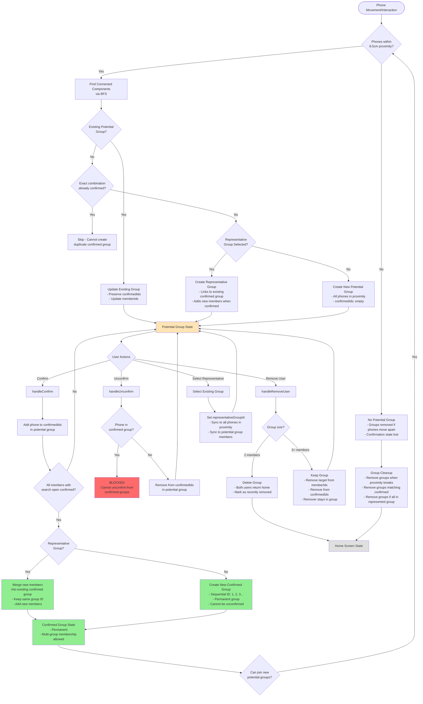
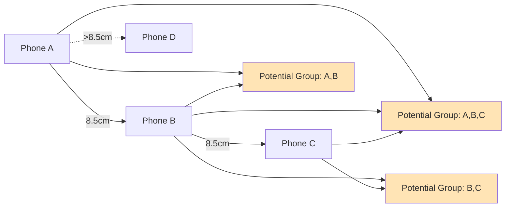
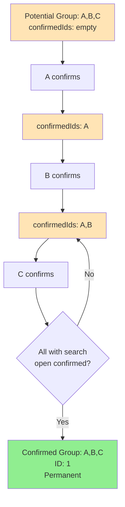
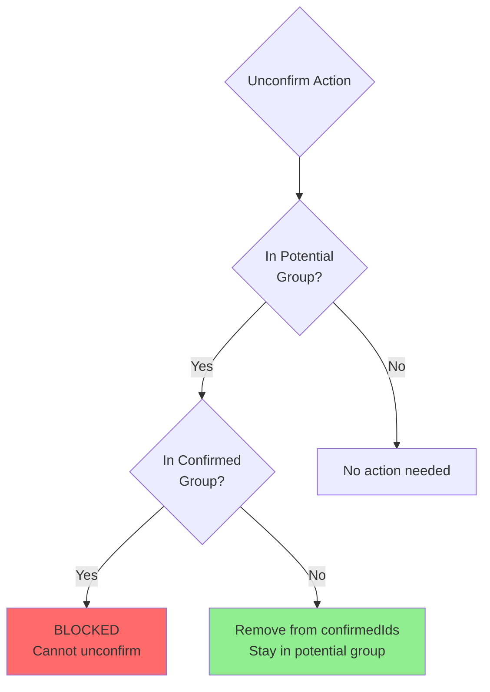
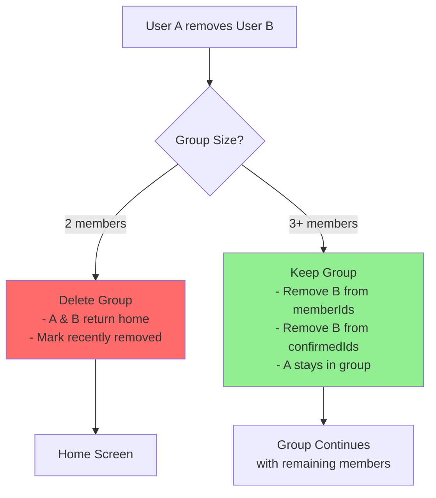
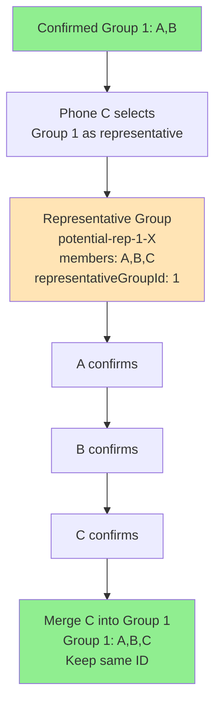
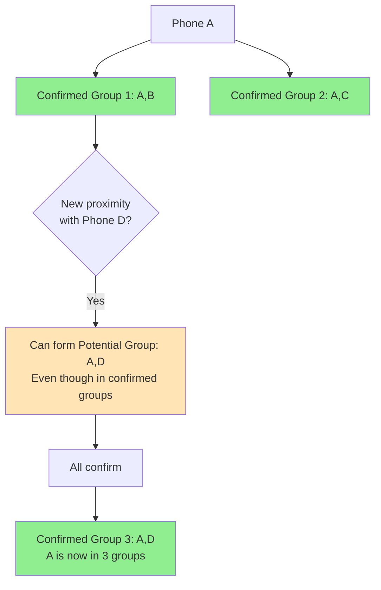
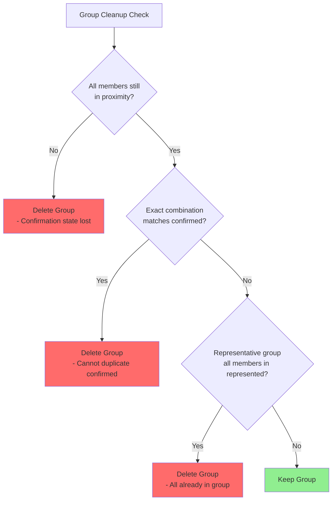
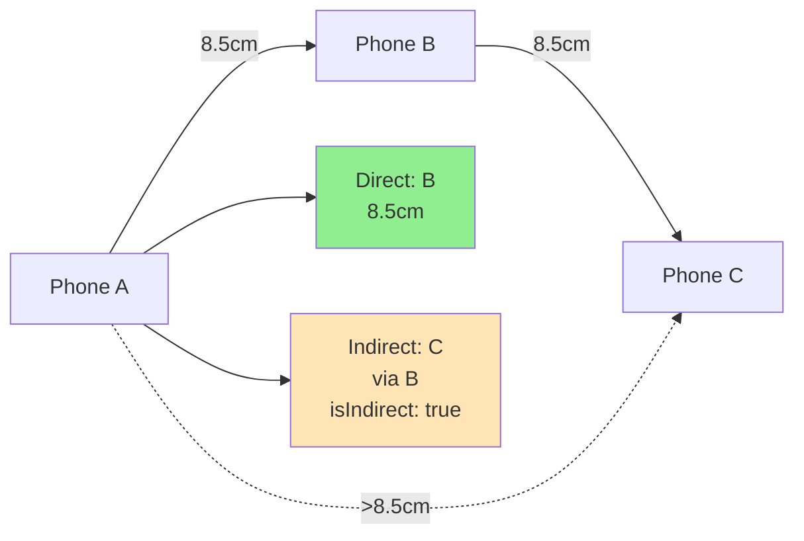

# Grouping System Flow Diagram

## Detailed Case Breakdown

### Case 1: Group Formation

### Case 2: Confirmation Flow

### Case 3: Unconfirmation Cases

### Case 4: User Removal Cases

### Case 5: Representative Groups

### Case 6: Multi-Group Membership

### Case 7: Group Cleanup Scenarios

### Case 8: Daisy-Chaining Detection

## Key Rules Summary

1. **Proximity Threshold**: 8.5cm edge-to-edge distance
2. **Group Formation**: Dynamic, based on real-time proximity
3. **Confirmation**: All members with search open must confirm
4. **Unconfirmation**: Only from potential groups, never from confirmed
5. **Removal**: 2-member groups deleted, 3+ member groups continue
6. **Representative Groups**: Merge into existing confirmed groups
7. **Multi-Group**: Phones can be in multiple confirmed groups
8. **Cleanup**: Groups removed when proximity breaks or exact match exists

